# Todo Application - UML Documentation (Mermaid)

## Overview

This is a React-based Todo application with Firebase authentication and Firestore for cloud storage. The app supports both authenticated (cloud-synced) and anonymous (local storage) modes.

---

## Class Diagram

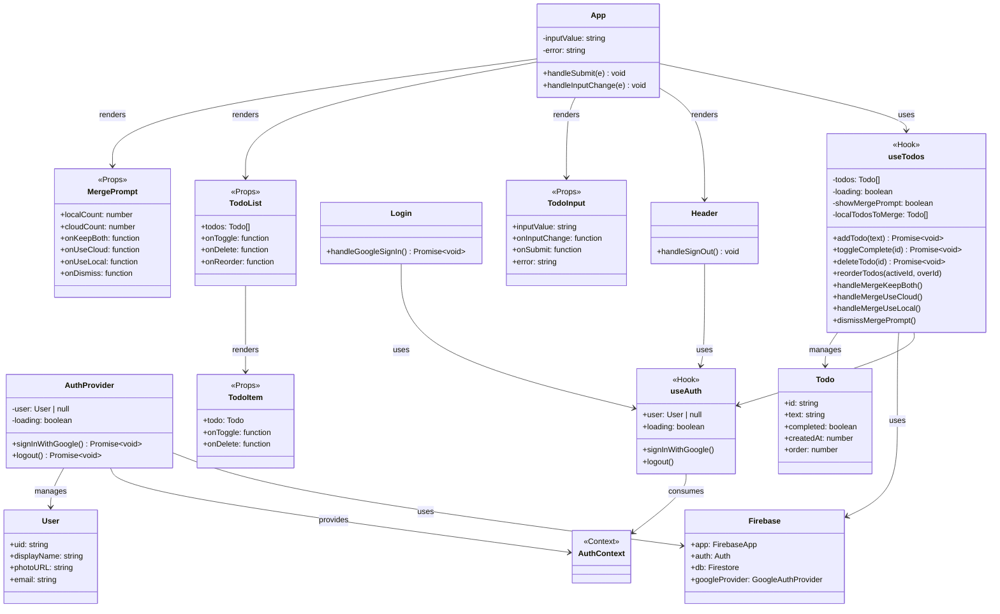

---

## Data Models

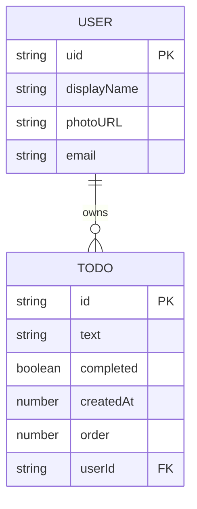

---

## Component Hierarchy

```mermaid
graph TD
    subgraph Entry["main.jsx"]
        SM[StrictMode]
    end
    
    SM --> AP[AuthProvider]
    AP --> BR[BrowserRouter]
    BR --> Routes
    
    Routes --> R1["Route '/'"]
    Routes --> R2["Route '/login'"]
    
    R1 --> App
    R2 --> Login
    
    App --> Header
    App --> TodoInput
    App --> TodoList
    App --> MergePrompt
    
    TodoList --> TI1[TodoItem]
    TodoList --> TI2[TodoItem]
    TodoList --> TIn[TodoItem ...]
    
    style Entry fill:#1a1a2e
    style App fill:#16213e
    style Login fill:#16213e
```

---

## Sequence Diagrams

### 1. User Authentication Flow

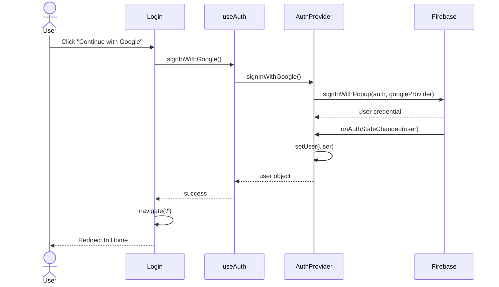

### 2. Add Todo Flow (Authenticated User)

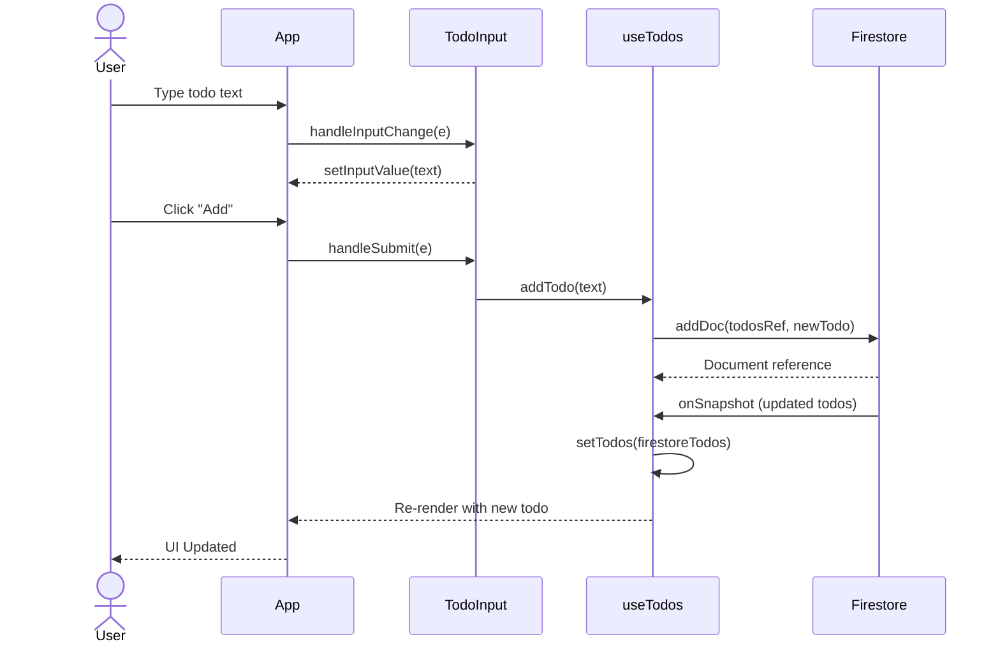

### 3. Data Merge Flow (User Signs In with Local Todos)

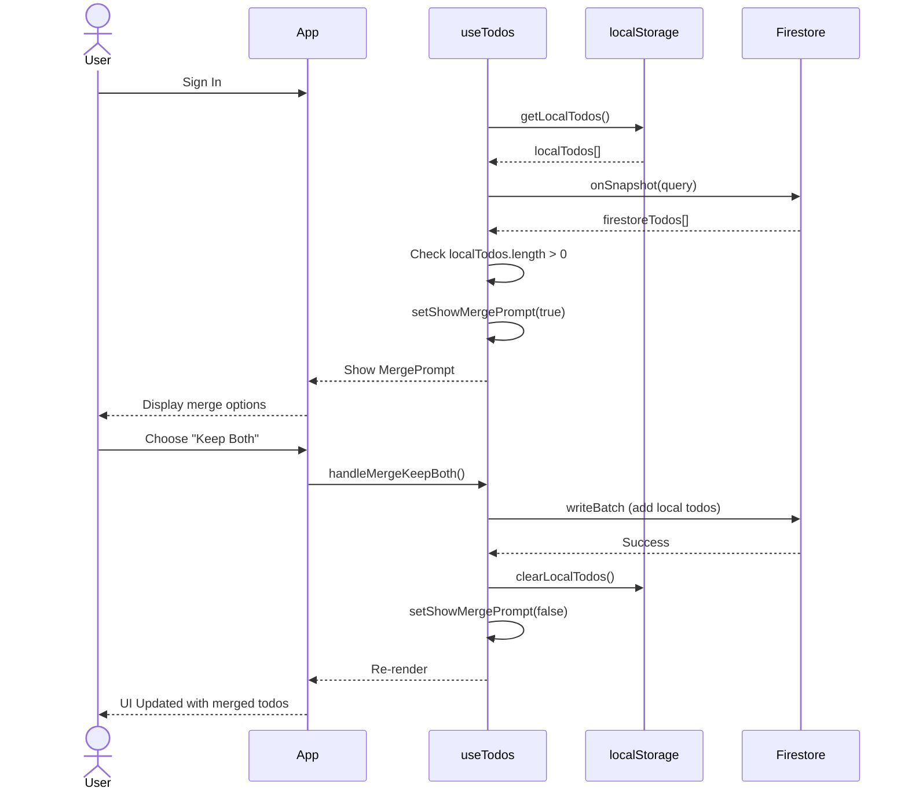

---

## State Diagram - Todo Item

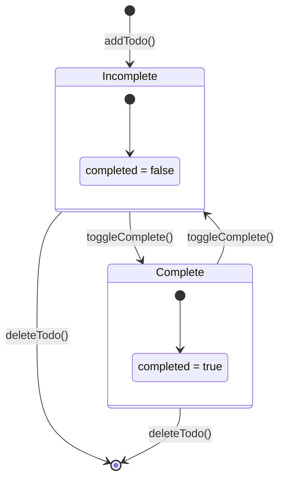

---

## Activity Diagram - Application Initialization

```mermaid
flowchart TD
    A[Start] --> B[Initialize Firebase App]
    B --> C[AuthProvider Mounted]
    C --> D[Subscribe to onAuthStateChanged]
    D --> E{Auth State Determined?}
    
    E -->|User Signed In| F[Connect Firestore Listener]
    E -->|No User| G[Load localStorage Todos]
    
    F --> H{Local Todos Exist?}
    H -->|Yes| I[Show Merge Prompt]
    H -->|No| J[Load Firestore Todos]
    
    I --> K[User Chooses Merge Option]
    K --> J
    
    G --> L[Set Todos from localStorage]
    J --> M[Set Todos from Firestore]
    
    L --> N[Render App with Todos]
    M --> N
    
    N --> O[End]
    
    style A fill:#0d1117,stroke:#30363d
    style O fill:#0d1117,stroke:#30363d
    style I fill:#238636,stroke:#2ea043
```

---

## Deployment Diagram

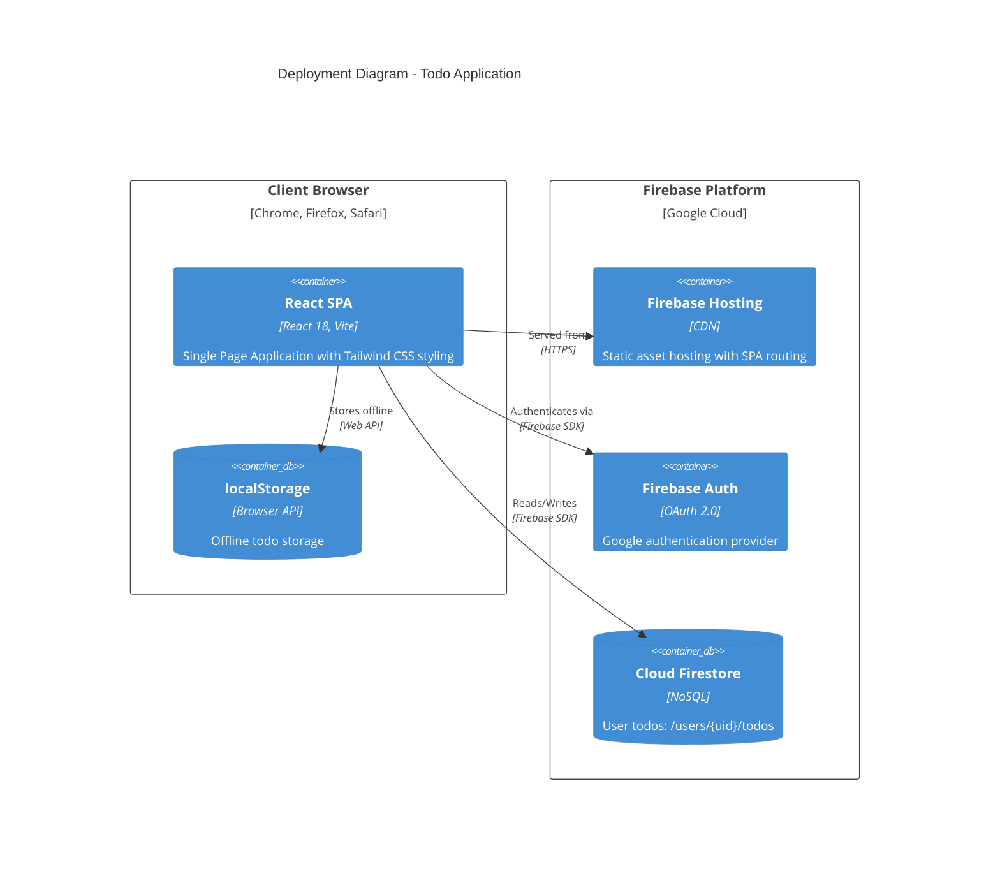

---

## Architecture Overview

```mermaid
graph TB
    subgraph Client["Client Browser"]
        subgraph React["React Application"]
            Components[Components Layer]
            Hooks[Hooks Layer]
            Context[Context Layer]
        end
        LS[(localStorage)]
    end
    
    subgraph Firebase["Firebase Platform"]
        FH[Firebase Hosting]
        FA[Firebase Auth]
        FS[(Cloud Firestore)]
    end
    
    Components --> Hooks
    Hooks --> Context
    Hooks --> LS
    Context --> FA
    Hooks --> FS
    FH --> React
    
    style Client fill:#1a1a2e,stroke:#e94560
    style Firebase fill:#0f3460,stroke:#e94560
    style React fill:#16213e,stroke:#0f3460
```

---

## Technology Stack

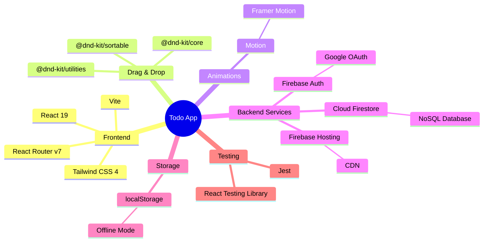

---

## File Structure

```mermaid
graph LR
    subgraph src["/src"]
        main["main.jsx<br/>(Entry Point)"]
        app["App.jsx<br/>(Root Component)"]
        fb["firebase.js<br/>(Config)"]
        css["index.css<br/>(Styles)"]
        
        subgraph context["/context"]
            ac["AuthContext.js"]
            ap["AuthProvider.jsx"]
        end
        
        subgraph hooks["/hooks"]
            ua["useAuth.js"]
            ut["useTodos.js"]
        end
        
        subgraph components["/components"]
            hd["Header.jsx"]
            lg["Login.jsx"]
            ti["TodoInput.jsx"]
            tl["TodoList.jsx"]
            tm["TodoItem.jsx"]
            mp["MergePrompt.jsx"]
        end
    end
    
    main --> app
    app --> components
    components --> hooks
    hooks --> context
    context --> fb
    
    style src fill:#1a1a2e
    style context fill:#16213e
    style hooks fill:#16213e
    style components fill:#16213e
```

---

## User Flow

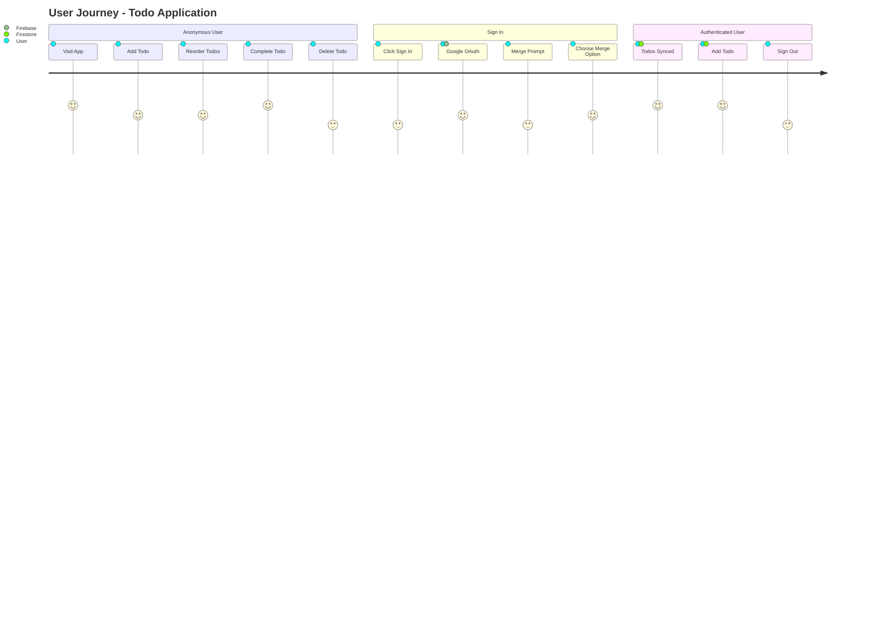
